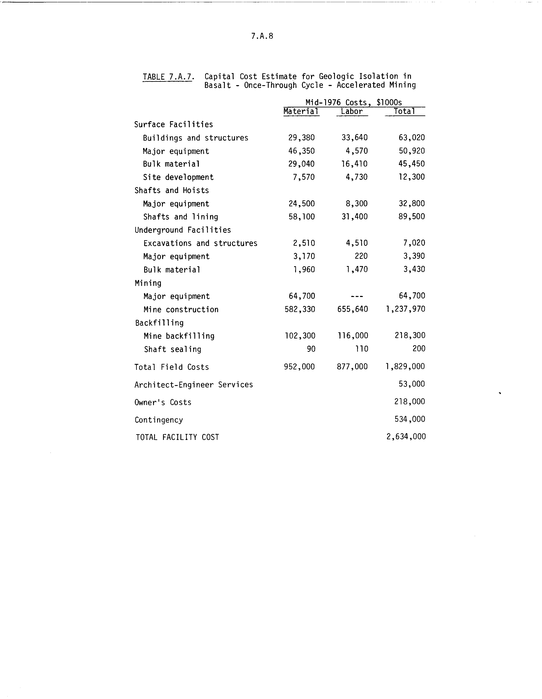

# table-detection-dataset

This repository contains dataset for table detection in documents and images. It has more than 400 images with their labels containing the coordinates for the table in the picture. I has two csv files for separating them in train and validation dataset. The following is the example of the dataset.

The format of the CSV is as follows

| filename    | xmin        | ymin | xmax | ymax| class |
| ------------- |:-------------:|:------:|:------:|:-----:|:-------:|
|0151_180.png | 270	|1653	|2280	|2580|	table|

